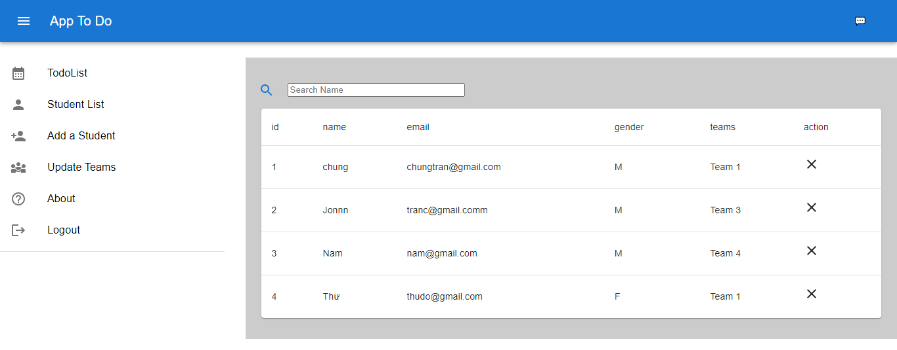
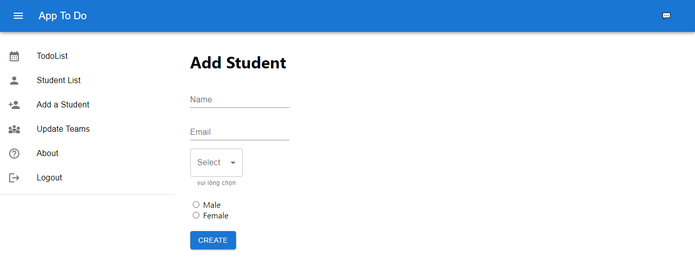
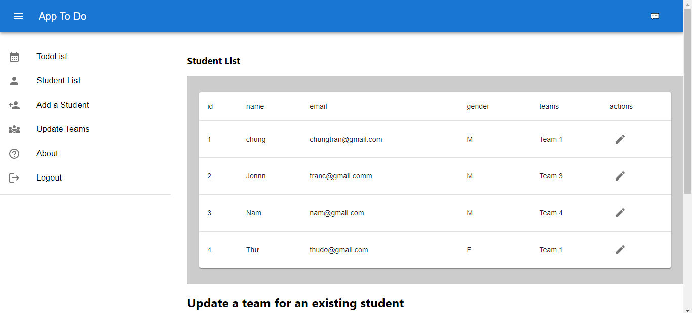
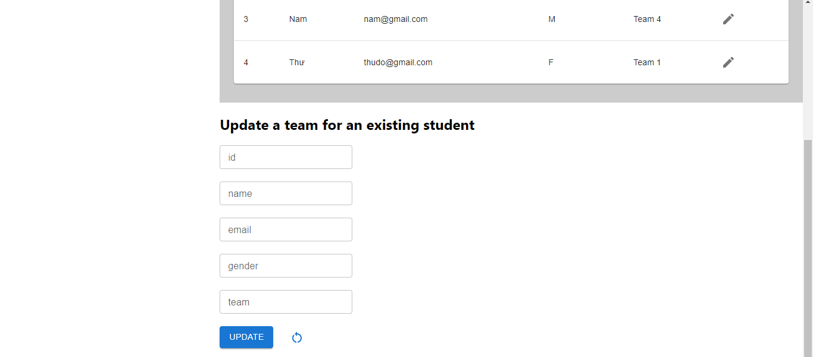
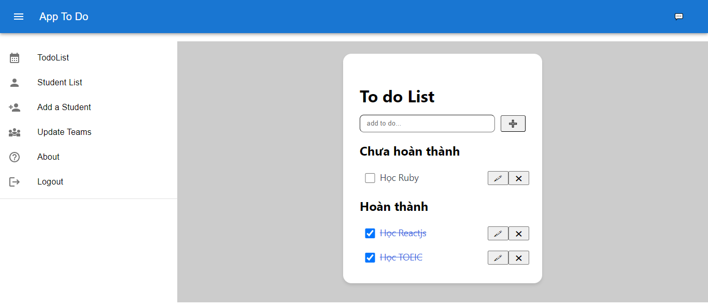

## Introduction
***
- This is a Website TodoList (CRUD) to manage the list 
  - FE: ReactJs, Material UI, JavaScript, React Hook, React-Hook-Form, React-Router-Dom.
  - API: Json_Server.

- Link Demo:... ( improving further ) 

## Features
***
- Main function CRUD
- TodoList
    - Add Todo.
    - Check Todo ( Complete or Incomplete ).
    - Edit Todo.
    - Remove Todo.
- StudentList ( Call API )
    - Search student.
    - Add student.
    - Update student.
    - Remove student.
- ....

## Page
***
- Home Page ( Search and Delete)

- Add student

- Update student

- Update student 

- TodoList

